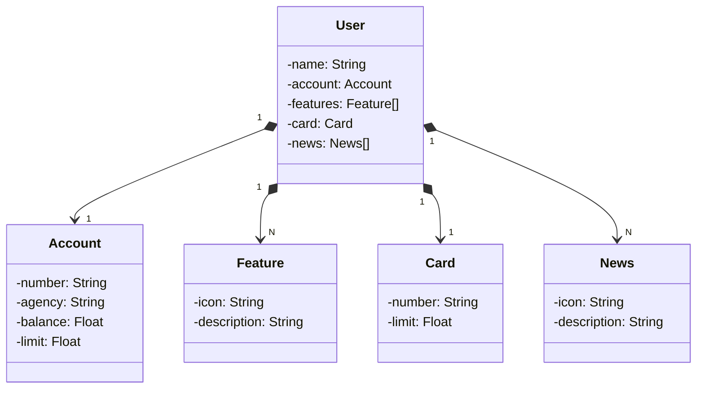

# Santander-API na nuvem com Railway
Último projeto de API RESTful do bootcamp santander 2023. (API simples, com 2 endpoints, ainda em evolução)

## Tecnologias Utilizadas
* ### Java 17:
  linguagem principal para desenvolvimento do back-end deste projeto. Linguagem madura e robusta, entre as mais utilizadas para
  desenvolvimento de software em todo mundo.
* ### Spring boot 3:
  Framework mais conhecido pela comunidade Java, que fornece várias funcionalidades para facilitar o desenvolvimento
  e melhorar a produtividade. Sua premissa de autoconfiguração é de grande utilidade, e por isso utilizaremos no projeto.
* ### Spring Data JPA:
  Utilizado no projeto como camada de acesso a banco de dados SQL, muito mais simplificada e abstraída.
  Fornece os principais métodos para CRUD e permite também fazer queries personalidadas.
* ### OpenAPI (Swagger):
  Vamos criar uma documentação de API eficaz e fácil de entender usando a OpenAPI (Swagger), perfeitamente alinhada com a alta produtividade que o Spring Boot oferece.
* ### Railway:
  PLataforma que facilita o deploy e monitoramento de nossas soluções na nuvem, além de oferecer diversos bancos de dados como serviço e pipelines de CI/CD.

## Diagrama de Classes

## URL da API em produção
https://santander-api-2023-prd.up.railway.app/
API ficará disponível por tempo limitado. Pelo menos enquanto eu puder pagar haha.

## Documentação Swagger da API 
https://santander-api-2023-prd.up.railway.app/swagger-ui/index.html
Esta documentação é vinculada a API, então ficará disponível mesmo tempo que o endpoint.

