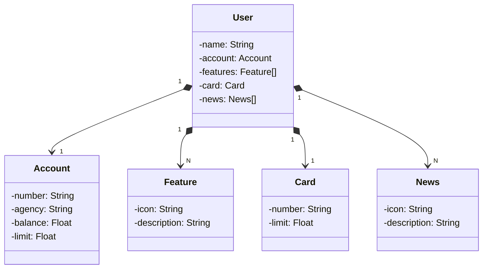

# Santander-API na nuvem com Railway
Último projeto de API RESTful do bootcamp santander 2023

## Tecnologias Utilizadas
* ### Java 17:
  linguagem principal para desenvolvimento do back-end deste projeto. Linguagem madura e robusta, entre as mais utilizadas para
  desenvolvimento de software em todo mundo.
* ### Spring boot 3:
  Framework mais conhecido pela comunidade Java, que fornece várias funcionalidades para facilitar o desenvolvimento
  e melhorar a produtividade. Sua premissa de autoconfiguração é de grande utilidade, e por isso utilizaremos no projeto. 

## Diagrama de Classes

